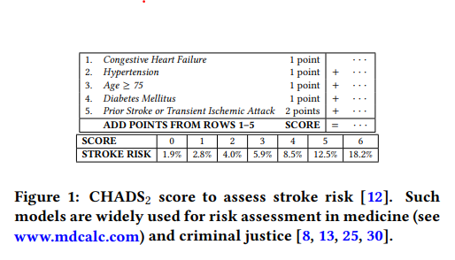

# Scorepyo

<!--  -->
<!--  -->


<div style="text-align: left">Image by <a href="https://www.freepik.com/free-vector/scorpion-branding-logo-template_21251044.htm#page=2&query=scorpio&from_query=scorpio%20logo&position=3&from_view=search&track=sph">Freepik</a></div>
<br />
<br />

**Scorepyo** is a python package for creating risk-score type models for binary classification, based on data. The created models can be used like other ML models, with fit and predict methods.
<br /> <br />

### *Example on Scikit-learn breast cancer dataset*
<br />

```python
import pandas as pd
from sklearn.datasets import load_breast_cancer

from scorepyo.binary_featurizer import AutoBinarizer
from scorepyo.models import OptunaRiskScore

# Getting data
data = load_breast_cancer()
data_X, y = data.data, data.target

X = pd.DataFrame(data=data_X, columns=data.feature_names)

# Binarization
binarizer = AutoBinarizer(max_number_binaries_by_features=3)
binarizer.fit(X, y)

X_binarized, df_info = binarizer.transform(X)

# Fitting the risk-score model
scorepyo_model = OptunaRiskScore(
    nb_max_features=4,
    min_point_value=-1,
    max_point_value=2,
    df_info=df_info["feature"].reset_index(),
)

scorepyo_model.fit(X_binarized, y)

scorepyo_model.summary()
```
#### Feature-point card 


| Feature         | Description            |   Point(s) | |      |
|:----------------|:-----------------------|--------:|---: |--------:|
| mean perimeter   | mean perimeter >= 95.84 | -1         || ...   |
| mean compactness | mean compactness < 0.08 | 1          | |+ ... |
| radius error     | radius error < 0.25     | 2          | |+ ... |
| worst radius     | worst radius < 13.53    | 2          | |+ ... |
|                 |                        |         |  |        |
|                 | |<div style="text-align: right"> **SCORE =**</div> | |**...**|

####   Score card     
| SCORE   | -1     | 0      | 1      | 2      | 3      | 4      | 5      |
|:--------|:-------|:-------|:-------|:-------|:-------|:-------|:-------|
| RISK    | 18.24% | 37.75% | 62.25% | 81.76% | 92.41% | 97.07% | 98.90% |

<br />
<br />

# Installation
Python 3.8, 3.9

```shell
pip install scorepyo
```
<br />

# Risk-Score model

Risk-score model are mostly used in medicine, justice, psychology or even credit application. They are widely appreciated, as the computation of the risk is fully explained with two simple tables:
* a point-card, with points to sum depending on features value;
* a score-card that associate a score to a risk. <br />Final score is computed by summing the points defined by the point-card.

The points should be small integers, in order to be easily manipulated and remembered by people using them. 

You can find hereafter another example of such risk-score model for assessing a stroke risk:

<!--  -->


<div style="text-align: left"> Source: <a href="http://jmlr.org/papers/v20/18-615.html" target="_blank">Learning Optimized Risk Scores</a> <br>
<!-- Berk Ustun and Cynthia Rudin<br>
Journal of Machine Learning Research, 2019.</div>  
<br /> -->
<br />
The extreme interpretability of such model is especially useful since it helps to understand and trust the model decision, but also to easily investigate fairness issues and make sure to satisfy legal requirements, and eventually remember it.

The simple computation also allows to write it down on a piece of paper for usage.

<br />

# Components of Scorepyo
The **Scorepyo** package provides two components that can be used independently:
* **Automatic feature binarizer**
* **Risk-score model**

##  Automatic feature binarizer
Datasets usually comes with features of various type. Continuous feature must be binarized in order to be used for risk-score model. 
Scorepyo leverages the awesome <a href="https://github.com/interpretml/interpret" target="_blank">interpretML</a> package and their EBM model to automatically extract binary features.

## Optuna-based Risk score model
The risk-score model can be modeled as an optimization problem with 3 sets of decision variables:
* Subset of binary features to use
* Points associated to each selected binary feature
* Log-odd intercept when 0 point

The objective function is the minimization of the logloss of the computed risk on training samples.


This formulation is already used in other packages such as <a href="https://github.com/ustunb/risk-slim" target="_blank">risk-slim</a> or <a href="https://github.com/jiachangliu/FasterRisk" target="_blank">FasterRisk</a>.

<br />

The novelty in **Scorepyo** is that it leverages the power of <a href="https://github.com/ustunb/risk-slim" target="_blank">Optuna</a> to efficiently sample values for the decision variables defined above. As Optuna has a highly active community, its improvements will also have benefits for this package.
<br /><br />


# Acknowledgements
> ### <a href="https://en.wikipedia.org/wiki/Standing_on_the_shoulders_of_giants" target="_blank">*Standing on the shoulders of giants*</a>
> #### <div style="text-align: right">*Bernard de Chartres* </div>
<br />

This package is mostly built on top of two great packages:
* <a href="https://github.com/interpretml/interpret" target="_blank">interpretML</a>
* <a href="https://github.com/ustunb/risk-slim" target="_blank">Optuna</a>

# More context

To better understand the justification of automatically creating risk score model from data, or to not only round coefficients from logistic regression, I refer to the great introduction of this Neurips 2022 paper associated with <a href="https://github.com/jiachangliu/FasterRisk" target="_blank">FasterRisk</a>:

 >>> https://arxiv.org/pdf/2210.05846.pdf.
 
 
#

<a href="https://github.com/ustunb/risk-slim" target="_blank">risk-slim</a> has an elegant approach mixing Machine Learning and Integer Linear Programming (ILP), that provides the ability to integrate preferences and constraints on the subset of features, and their associated point. It is unfortunately based on CPLEX, a commercial ILP solver that limits its use, and also have trouble converging in large dimensions.

#

<a href="https://github.com/jiachangliu/FasterRisk" target="_blank">FasterRisk</a> is a recent package that makes the computation much faster by dropping the ILP approach and providing an other approach to explore this large space of solutions and generate a list of interesting risk-score models that will be diverse. This approach does not integrate constraints as risk-slim does, but does a great job at quickly computing risk-score models. It does not provide an automatic feature binarizer though.


