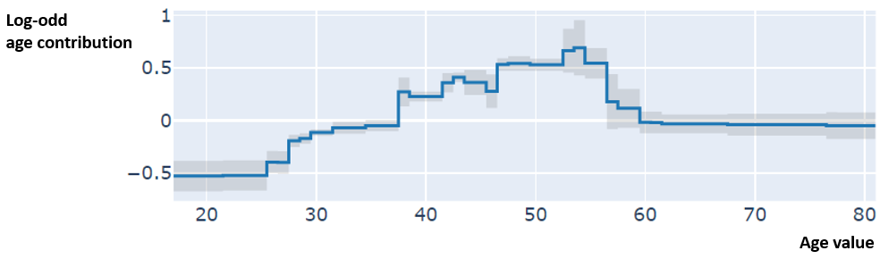
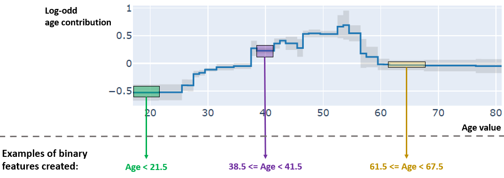

# Automatic feature binarizer

A risk-score type model can only be constructed based on binary features.  In most cases, datasets are constructed with a mix of continuous, categorical and binary features.  
From there, we either manually engineer the binary features, or we can automatically construct them.

## General Additive Model (GAM)
 
A risk-score model is an additive model, therefore we need to craft binary features in such a way that they help to predict by summing their contribution, modulo a coefficient. This corresponds to General Additive Model (GAM), that's why The `AutoBinarizer` class is based on a GAM that predicts the binary target.  

### Explainable Boosting Machine (EBM)

The GAM used is an Explainable Boosting Machine (EBM), from the fantastic <a href="https://github.com/interpretml/interpret">interpretML</a> package.

EBM are perfect candidates for such a task. Indeed the individual feature function in EBMs is a single-feature tree.
Hereafter is an example from the interpretML package for the feature *Age*.

We can observe that each single-feature tree defines intervals on the feature domain, and a constant value on each interval. In a binary classification setting, that constant value is the log-odd to add for each sample depending on the feature value of each sample. 

'   '

The `AutoBinarizer` class extracts every plateau of single-feature trees of the fitted EBM. Plateau with a negative log-odd value can be filtered with the `keep_negative` parameter. The number of plateaux of single-feature tree, and thus binary features extracted by continuous feature, is bounded by the `max_number_binaries_by_features` parameter.
  

:::{admonition} Info
The log-odd value associated to each binary feature created is extracted. It can be used as a filter to make a selection afterwards.
:::

