# Scorepyo risk-score model

## Primer on risk-score model
Let's start with the introduction of risk-score model from <a href="https://en.wikipedia.org/wiki/Risk_score">Wikipedia</a>: 

>Risk score (or risk scoring) is the name given to a general practice in applied statistics, bio-statistics, econometrics and other related disciplines, of creating an easily calculated number (the score) that reflects the level of risk in the presence of some risk factors (e.g. risk of mortality or disease in the presence of symptoms or genetic profile, risk financial loss considering credit and financial history, etc.).  
<!-- >Risk scores are designed to be:
>* Simple to calculate: In many cases all you need to calculate a score is a pen and a piece of paper (although some scores use rely on more sophisticated or less transparent calculations that require a computer program).
>* Easily interpreted: The result of the calculation is a single number, and higher score usually means higher risk. Furthermore, many scoring methods enforce some form of monotonicity along the measured risk factors to allow a straight forward interpretation of the score (e.g. risk of mortality only increases with age, risk of payment default only increase with the amount of total debt the customer has, etc.).
>* Actionable: Scores are designed around a set of possible actions that should be taken as a result of the calculated score. Effective score-based policies can be designed and executed by setting thresholds on the value of the score and associating them with escalating actions. -->

A risk-score model is composed of :
* a feature-point card, indicating points for each feature
* a score card, associating a risk to a score

Here is CHADS2, an example of risk-score model for stroke risk of people with a specific condition (<a href="https://en.wikipedia.org/wiki/CHA2DS2%E2%80%93VASc_score#CHADS2">Image source</a>):

  

What motivates the use of such model?

## Motivation

Risk-score models sacrifice the performance in terms of classification performance, in favor to all the following aspects:
* understand and trust the model decision
* investigate fairness issues
* make sure to satisfy legal requirements
* remember it
* be able to use it with a paper and pen

The extreme interpretability comes from 3 properties : binary features, the additive aspect and sparse small integer coefficients. 
The binary features aspect is independent from the model. However the additive aspect can be found in logistic regression, and the sparse coefficients property is tunable via a L1 regularization. A first simple approach could be to fit a logistic regression with L1 regularization, and round the coefficient in order to have small integers. 

:::{admonition} Logistic regression approach
For further explanation on the drawback of the rounding of logistic regression approach, the Neurips 2022 paper <a href="https://arxiv.org/pdf/2210.05846.pdf">FasterRisk: Fast and Accurate Interpretable Risk Scores</a> adresses this issue in its introduction.
:::

## Architecture 

The problem can be decomposed into finding the subset of binary features, defining points for each, and defining the probabilities of each possible score.

These 3 steps can be done at once or separately. The specificity of the *Scorepyo* package is that it does not rely on the logistic function to link scores and associated probability. It allows to have a wider  model search-space, with more freedom on model probabilities. 

*Scorepyo* first combines binary feature selection and points definition, then defines the probability for each possible score. 

We can represent the different steps as follows :

### Binary feature selection and points definition

The binary features selection and points definition can be decomposed into 2 steps :
* Ranking of binary features
* Enumeration and maximization

#### Ranking of binary features

Once the binary features are created, a binarizer such as `EBMBinarizer` stores information about the process, such as the associated log-odds, the density (number of samples positive on this binary feature) and the name of the feature it originates from. All these information can be used to rank the features.

`GIVE EXAMPLE OF RANKER TO ILLUSTRATE AND REFER TO THE RANKERS PAGE

CREATE PAGE WITH ALL DIFFERENT RANKERS

#### Binary features combination and points enumeration

TODO

### Probability calibration

TODO

<!-- ## interpretation of feature point
log odds, similar to log regression -->

<!-- 
## Problem formulation

The risk-score model can be modeled as an optimization problem with 3 sets of decision variables.

### Sets, parameters and variables
We can introduce the following notations:

* Sets
    * $\{i \in [1,...,n]\}$, set of indices of binary features
    * $X=[X_j, j \in [1,...,m]]$, set of samples with $X_j \in \{0,1\}^{m}$
    * $y=[y_j \in \{0,1\}, j \in [1,...,m]]$, set of binary target value
* Parameters
    * $N_{\text{min}}, N_{\text{max}}$, resp. minimum and maximum number of selected features
    * $V_{\text{min}}$, $V_{\text{max}}$, resp. minimum and maximum value for points associated to selected features
* Variables
    * feature selection variables (*binary*) : $f_i$, equals to $1$ if feature $i$ is selected for the risk-score model
    * log-odd/point variables (*relative integer*) : $points_i$, points associated to each binary feature
    * log-odd intercept (*continuous*): $intercept$, log-odd when risk score is equal to 0

### Objective function
The objective function is the minimization of the logloss of the computed risk on training samples:

$min \sum_{j=1}^{m}y_jlog(p_j) +(1-y_j)log(1-p_j)$

with $p_j = \frac{1}{1+e^{-[\sum_i (points_iX_{ji} F_i)+intercept]}}$

### Constraints
#### Min. and max. number of features

This constraint enforces that the number of selected features lies in the interval defined by $N_{\text{min}}$ and $N_{\text{max}}$.

$N_{\text{min}} \leq \sum_{i=1}^n f_i \leq N_{\text{max}}$

#### Min. and max. points value and link

<!-- These constraints enforce that each points value associated to the selected features lies in the interval defined by $V_{\text{min}}$ and $V_{\text{max}}$.

$V_{\text{min}} \leq points_i \leq V_{\text{max}}, \forall i\in [1,...,n]$

#### Link selection of features and points associated -->

<!-- These constraints serve two purposes : bound point values to their possible minimum and maximum values, and link selection of features and their associated points. Indeed, we want to make sure that non-selected features will have 0 point associated to them.

$V_{\text{min}}f_i \leq points_i \leq V_{\text{max}}f_i, \forall i \in [1,...,n]$ 

:::{admonition} Note
Note that in this formulation, the maximum number of selected features is always respected, unlike the minimum number of selected features. The model could select some features and assign them 0 point, this would be equate to not selecting that feature.
:::

We could also add other constraints, such as limit or force the number of selected features within defined subsets, etc.

<!-- ## Optuna implementation -->
<!--In this formulation, there are $2n+1$ variables and $n+1$ constraints, with $n$ being the number of binary features. The size of this problem is relatively small, but the hard part is in the combination of the objective function, which involves a non linear (log-loss) function with a lot of samples, and integer variables.

## Optuna modelization

To handle this problem with Optuna, we should not exactly use the same variables, as it is better to have a smaller number of variables with larger domain.

### Sets, parameters and variables

* Sets
    * $\{i \in [1,...,n]\}$, set of binary features
    * $X=[X_j, j \in [1,...,m]]$, set of samples with $X_j \in \{0,1\}^{m}$
    * $y=[y_j \in \{0,1\}, j \in [1,...,m]]$, set of binary target value
* Parameters
    * $N_{\text{min}}, N_{\text{max}}$, resp. minimum and maximum number of selected features
    * $V_{\text{min}}$, $V_{\text{max}}$, resp. minimum and maximum value for points associated to selected features
* Variables
    * feature selection variables (*categorical*) : $cf_k$, equals to $i$ if feature $i$ is selected for the risk-score model for the $k^{th}$ selected features, $k \in [1,...,N_{\text{max}}]$
    * log-odd/point variables (*relative integer*) : $points_k$, points associated to $k^{th}$ selected features
    * log-odd intercept (*continuous*): $intercept$, log-odd when risk score is equal to 

Observe that now we are left only with $2N_{\text{max}}+1$ variables
    
### Objective function
The objective function is still the minimization of the logloss of the computed risk on training samples:

$min \sum_{j=1}^{m}y_jlog(p_j) +(1-y_j)log(1-p_j)$

with $p_j = \frac{1}{1+e^{-[\sum_k (points_kX_{jcf_k} F_{cf_k})+intercept]}}$

Since Optuna offers the possibility to put any objective function, we can also use other classification metrics (e.g. average precision, ROC AUC).

It will efficiently samples value for the $2N_{\text{max}}$ variables in order to minimize the log-loss.

:::{admonition} Note
Note that nothing prevents Optuna to sample a value of 0 point for one of the selected binary features.

The `OptunaRiskScore` model will implement in future developments the enforcement of the selection of a minimum number of features. 
::: --> 

## Other packages

### Risk-slim

<a href="https://github.com/ustunb/risk-slim" target="_blank">risk-slim</a> has an elegant approach mixing Machine Learning and Integer Linear Programming (ILP), that provides the ability to integrate preferences and constraints on the subset of features, and their associated point. It is unfortunately based on CPLEX, a commercial ILP solver that limits its use, and also have trouble converging in large dimensions.

### FasterRisk

<a href="https://github.com/jiachangliu/FasterRisk" target="_blank">FasterRisk</a> is a recent package that makes the computation much faster by dropping the ILP approach and providing an other approach to explore this large space of solutions and generate a list of interesting risk-score models that will be diverse. This approach does not integrate constraints as risk-slim does, but does a great job at quickly computing risk-score models. It does not provide an automatic feature binarizer though.

### Comparison performance with FasterRisk

Coming soon.